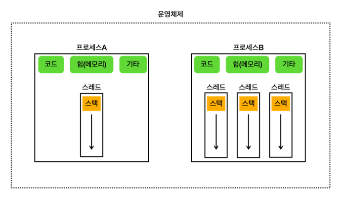

# Section 02. 프로세스와 스레드 소개

## 멀티태스킹과 멀티프로세싱
### 멀티태스킹

CPU 코어가 하나인 환경에서 한 번에 하나의 프로그램 코드만 실행할 수 있지만, 모든 작업을 순차적으로 실행하면 비효율적이다. 
이를 해결하기 위해 하나의 CPU 코어로 여러 프로그램을 동시에 실행하는 것처럼 보이게 하는 기술이 바로 '멀티태스킹'이다.

> 프로그램의 실행이란? 프로그램을 구성하는 코드를 순서대로 CPU에서 연산(실행)하는 일

### 멀티프로세싱
**멀티프로세싱**(Multiprocessing)은 컴퓨터 시스템에서 둘 이상의 프로세서(CPU 코어)를 사용하여 여러 작업을 동시에 처리하는 기술을 의미한다. 
멀티프로세싱 시스템은 하나의 CPU 코어만을 사용하는 시스템보다 동시에 더 많은 작업을 처리할 수 있다.

### 멀티프로세싱 VS 멀티태스킹
멀티프로세싱은 **하드웨어 장비의 관점**이고, 멀티태스킹은 **운영체제 소프트웨어의 관점**이다.

- 멀티프로세싱: 여러 CPU 코어를 사용하여 동시에 여러 작업을 수행하는 것을 의미하며, 하드웨어 기반으로 성능을 향상시킨다.
- 멀티태스킹:단일 CPU 코어가 여러 작업을 동시에 수행하는 것처럼 보이게 하는 것을 의미하며, 소프트웨어 기반으로 CPU 시간을 분할하여 각 작업에 할당한다.

## 프로세스와 스레드
### 프로세스
프로세스는 실행 중인 프로그램의 인스턴스로, 운영체제에서 독립적인 작업 단위로 관리된다. 
각 프로세스는 별도의 메모리 공간을 가지고 있어 서로 간섭하거나 직접 접근할 수 없으며, 하나의 프로세스에 문제가 발생해도 다른 프로세스에는 영향을 미치지 않는다.

#### 프로세스의 메모리 구성
- **코드 섹션**: 실행할 프로그램의 코드가 저장되는 부분
- **데이터 섹션**: 전역 변수 및 정적 변수가 저장되는 부분 (그림에서 기타에 포함)
- **힙 (Heap)**: 동적으로 할당되는 메모리 영역
- **스택 (Stack)**: 메서드(함수) 호출 시 생성되는 지역 변수와 반환 주소가 저장되는 영역 (스레드에 포함)

### 스레드
스레드는 프로세스 내에서 실행되는 작업의 단위이며, 하나의 프로세스에는 하나 이상의 스레드가 포함된다.
스레드는 동일한 메모리 공간을 공유하며, 생성 및 관리가 프로세스보다 단순하고 가볍다. 

**단일 스레드**는 하나의 스레드로 작동하는 프로세스를 의미하며, **멀티 스레드**는 여러 스레드가 존재하는 프로세스를 의미한다.

## 스레드와 스케줄링
스레드는 프로세스 내에서 실제로 CPU를 사용해 코드를 실행하는 단위이며, 스케줄링은 운영체제가 CPU를 어떻게 분배할지 결정하는 과정이다. 
단일 코어 환경에서는 운영체제가 스케줄링 큐에서 대기 중인 스레드들을 순차적으로 실행하며, 멀티 코어 환경에서는 여러 스레드를 물리적으로 동시에 실행할 수 있다. 
스케줄링은 단순히 시간을 분할하는 것이 아니라, CPU 활용을 극대화하기 위해 다양한 우선순위와 최적화 기법을 사용한다.

## 컨텍스트 스위칭
컨텍스트 스위칭은 멀티태스킹 과정에서 작업 전환을 위해 현재 실행 중인 스레드의 상태(변수 값, 코드 위치 등)를 메모리에 저장하고, 다음 작업을 실행할 때 이를 다시 불러오는 과정이다. 
이 과정에는 추가적인 비용이 발생하므로 멀티스레딩이 항상 효율적인 것은 아니다. 
작업을 순차적으로 완료하는 경우보다 컨텍스트 스위칭이 많은 경우, 오히려 비효율적일 수 있다.

### CPU 바운드 작업 vs I/O 바운드 작업

스레드가 하는 작업은 CPU-바운드 작업과 I/O-바운드 작업으로 나뉜다.

- **CPU-바운드 작업**: CPU의 계산 능력이 중요한 작업으로, 복잡한 연산과 알고리즘 실행 등이 해당된다. CPU 코어 수에 맞춰 스레드 수를 설정하는 것이 효율적이다.
- **I/O-바운드 작업**: 디스크, 네트워크 등 입출력 작업 대기 시간이 많은 작업으로, CPU는 대기 상태에 있는 경우가 많다. 웹 애플리케이션 서버에서 주로 발생하며, 스레드 수를 CPU 코어보다 더 많이 생성하여 CPU 활용도를 극대화하는 것이 중요하다.

웹 서버는 일반적으로 I/O-바운드 작업이 많아 CPU 사용률이 낮다. 
따라서 최적의 스레드 수를 설정해야 하며, 과도한 스레드 생성은 컨텍스트 스위칭 비용을 증가시키므로 성능 테스트로 적정 수를 찾아야 한다. 
CPU-바운드 작업이 많을 경우, CPU 코어 수에 최적화된 스레드 수를 설정하면 된다.