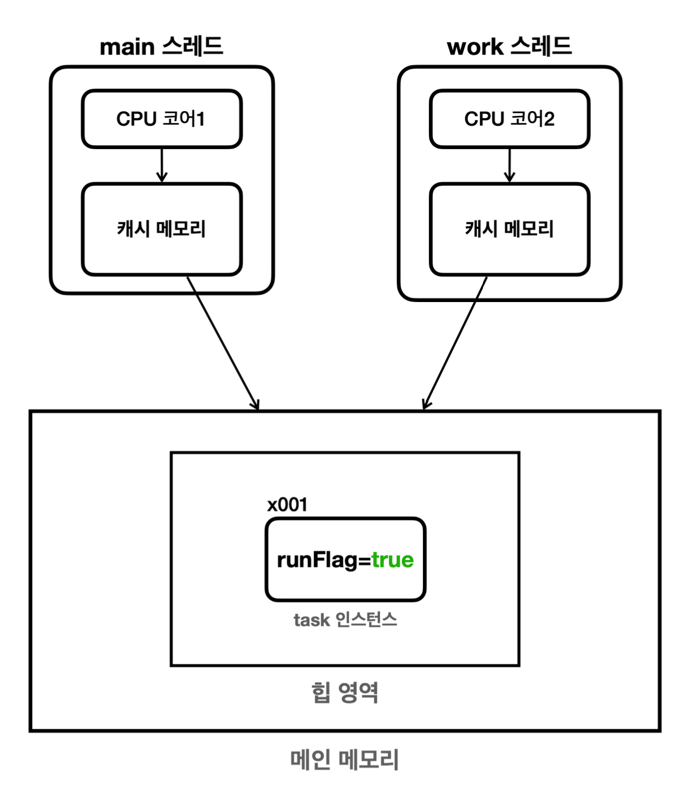

# Section 05. 스레드 제어와 생명 주기 2

## 메모리 가시성(memory visibility)
- 개념: 멀티스레드 환경에서 한 스레드가 변경한 메모리 값이 다른 스레드에서 언제 보이는지에 대한 문제.
- 캐시와 메인 메모리:
  - CPU는 데이터를 캐시 메모리에 저장하며, 메인 메모리와 동기화 시점은 CPU 설계와 실행 환경에 따라 다르다.
  - Thread.sleep() 또는 콘솔 출력과 같은 작업이 발생하면 컨텍스트 스위칭이 일어나면서 메모리가 갱신되는 경우가 있다. 그러나 이는 보장되지 않는다.
- 해결 방법: 메모리 가시성 문제를 확실히 해결하려면 volatile 키워드를 사용해야 한다.
- **volatile** 사용:
  - 멀티스레드 환경에서 메모리 가시성을 보장하며, 최신 값을 모든 스레드에서 읽을 수 있다.
  - 성능 저하가 있을 수 있으므로 필요한 경우에만 사용.

## 자바 메모리 모델(Java Memory Model, JMM)
- 개념: 자바에서 멀티스레드가 메모리에 접근하고 수정하는 방식을 정의한 모델.
- 핵심 개념:
  - happens-before 관계: 한 작업의 메모리 변경이 다른 작업에서 보이도록 순서를 정의.
  - 한 스레드에서의 작업이 다른 스레드에서 보이는 시점을 보장.

### happens-before 관계
1. 프로그램 순서 규칙: 단일 스레드 내에서는 코드가 작성된 순서대로 실행된다.
2. volatile 변수 규칙:
   - 한 스레드에서 volatile 변수에 대한 쓰기 작업은 다른 스레드에서 읽기 작업보다 먼저 발생한다.
3. 스레드 시작 규칙:
   - Thread.start() 호출 전에 수행된 작업은 새 스레드에서 실행되는 작업보다 먼저 발생한다.
4. 스레드 종료 규칙:
   - Thread.join() 호출 이전의 작업은 해당 스레드 종료 이후 작업보다 먼저 발생한다.
5. 인터럽트 규칙:
   - Thread.interrupt() 호출 후, 해당 스레드의 인터럽트 상태를 확인하는 작업이 먼저 발생한다.
6. 객체 생성 규칙:
   - 객체 생성자는 완료된 후 다른 스레드에서 해당 객체를 참조할 수 있다.
7. 모니터 락 규칙:
   - synchronized 블록에서의 작업은 해당 블록을 나갈 때 다른 스레드에서 볼 수 있다.
8. 전이 규칙:
   - A가 B보다, B가 C보다 먼저 발생하면 A는 C보다 먼저 발생한다.
