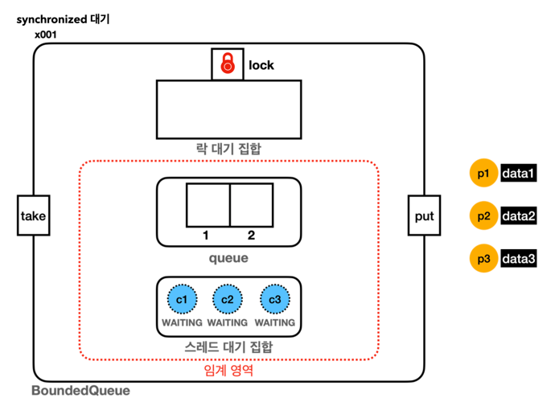
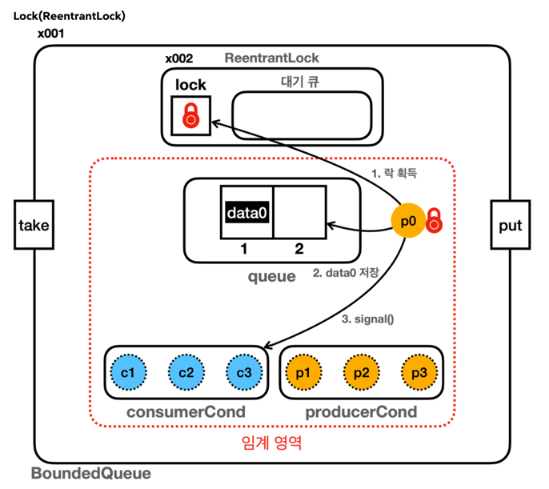

# Section 10. 생산자 소비와 문제2

## synchronized vs ReentrantLock 대기

### synchronized 대기
**대기1: 모니터 락 획득 대기**
- 자바 객체 내부의 모니터 락 대기 집합에서 관리
- `BLOCKED` 상태로 락 획득 대기
- `synchronized` 를 시작할 때 락이 없으면 대기
- 다른 스레드가 `synchronized`를 빠져나갈 때 락 획득 시도, 락 획득하면 락 대기 집합을 빠져나감

**대기2: wait() 대기**
- `wait()` 를 호출 했을 때 자바 객체 내부의 스레드 대기 지밥에서 관리
- `WAITING` 상태로 대기
- 다른 스레드가 `notify()`를 호출 했을 때 스레드 대기 집합을 빠져나감

---

### Lock(ReentrantLock)
**대기1: ReentrantLock 락 획득 대기**
- `ReentrantLock`의 대기 큐에서 관리
- `WAITING` 상태로 락 획득 대기
- `lock.lock()` 을 호출 했을 때 락이 없으면 대기
- 다른 스레드가 `lock.unlock()` 을 호출 했을 때 대기가 풀리며 락 획득 시도, 락을 획득하면 대기 큐를 빠
  져나감

**대기2: wait() 대기**
- `wait()` 를 호출 했을 때 자바 객체 내부의 스레드 대기 지밥에서 관리
- `WAITING` 상태로 대기
- 다른 스레드가 `notify()`를 호출 했을 때 스레드 대기 집합을 빠져나감