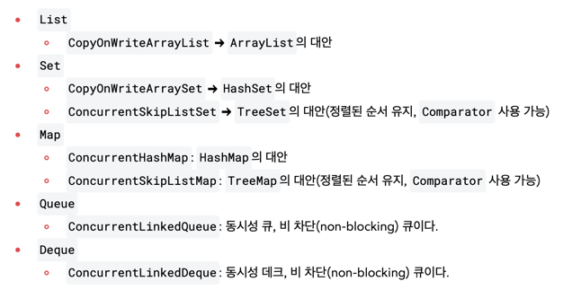

# Section 12. 동시성 컬렉션

## 동시성 컬렉션이 필요한 이유
`java.util` 패키지의 컬렉션 프레임워크가 제공하는 대부분의 연산은 원자적인 연산이 아니다. 즉, **스레드 세이프(Thread Safe)** 하지 않는다.

> 스레드 세이프(Thread Safe) - 여러 스레드가 동시에 접근해도 안전한 경우

싱글 스레드의 환경에서는 문제 없겠지만, 멀티 스레드의 환경에서는 동시성 문제가 발생할 수 있다.
따라서, 여러 스레드가 접근해야 한다면 `synchronized`, `Lock` 등을 통해 안전한 임계 영역을 만들어 문제를 해결해야 한다.

하지만 모든 컬렉션을 동기화 용으로 새로 구현하는 것은 매우 비효율적이다. 자바에서는 이를 편리하게 사용할 수 있도록 지원해준다.

## 자바 동시성 컬렉션 - synchronized

좋은 대안으로 `synchronized` 를 대신 적용해 주는 프록시를 만드는 방법이 있다. `List` , `Set` , `Map` 등 주요 인터페이스를 구현해서 `synchronized` 를 적용할 수 있는 프록시를 만들면 된다.
이 방법을 사용하면 기존 코드를 그대로 유지하면서 필요한 경우에만 동기화를 적용할 수 있다. 자바는 컬렉션을 위한 프록시 기능을 제공한다.

```java
Collections.synchronizedList(target);
```

```java
public static <T> List<T> synchronizedList(List<T> list) {
    return new SynchronizedRandomAccessList<>(list);
}

```
**Collections가 제공하는 동기화 프록시 기능**
- `synchronizedList()`
- `synchronizedCollection()` 
- `synchronizedMap()` 
- `synchronizedSet()` 
- `synchronizedNavigableMap()` 
- `synchronizedNavigableSet()` 
- `synchronizedSortedMap()` 
- `synchronizedSortedSet()`

## 자바 동시성 컬렉션 - 동시성 컬렉션
`synchronized` 프록시를 사용하는 방식은 아래와 같은 단점이 있다.
- 동기화 오버헤드
- 전체 컬렉션에 대해 동기화가 이루어지기 때문에 잠금 범위가 넓어진다. -> 동시성이 떨어짐
- 정교한 동기화가 불가능하다. -> 최적화가 거의 불가능함

`java.util.concurrent` 패키지에는 고성능 멀티스레드 환경을 지원하는 다양한 동시성 컬렉션 클래스들을 제공한다.

여기에 다양한 성능 최적화 기법들이 적용되어 있는데, `synchronized` , `Lock` ( `ReentrantLock` ), `CAS` , 분할 잠금 기술(segment lock)등 다양한 방법을 활용하여 정교한 동기화를 구현하면서 동시에 성능도 최적화했다. 
각각의 최적화는 매우 어렵게 구현되어 있기 때문에 자세한 구현을 이해하는 것 보다는 멀티스레드 환경에 필요한 동시성 컬렉션을 잘 선택해서 사용할 수 있으면 충분하다. 라고 하셨다..

**동시성 컬렉션의 종류**




참고로 `LinkedHashSet` , `LinkedHashMap` 처럼 입력 순서를 유지하는 동시에 멀티스레드 환경에서 사용할 수 있 는 `Set` , `Map` 구현체는 제공하지 않는다. 
필요하다면 `Collections.synchronizedXXX()` 를 사용해야 한다.

## 정리
동시성은 결국 성능 차이와 트레이드 오프가 있다. 단일 스레드 환경에서 컬렉션을 사용하는 경우에는 동시성 컬렉션이 아닌 일반 컬렉션을 사용해야 한다.